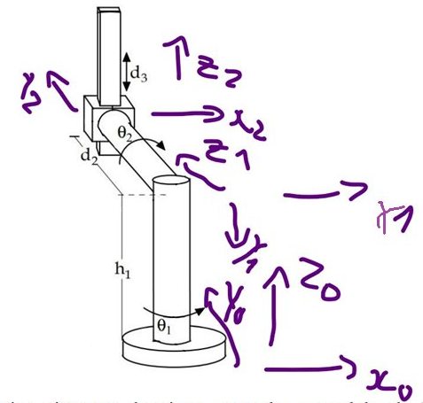

# Ficha 01 — Convenção de Denavit-Hartenberg (DH)

> Aparece em **TODOS** os exames como Q1 (10–15%)

---

## O que é

DH é uma convenção para descrever a geometria de um manipulador robótico com um conjunto mínimo de 4 parâmetros por junta.

---

## Os 4 parâmetros DH

| Parâmetro          | Símbolo | Tipo                             | Descrição                                |
| ------------------ | ------- | -------------------------------- | ---------------------------------------- |
| Ângulo da junta    | θᵢ      | **variável** se junta rotacional | Rotação em torno de Zᵢ₋₁                 |
| Offset da junta    | dᵢ      | **variável** se junta prismática | Translação ao longo de Zᵢ₋₁              |
| Comprimento do elo | aᵢ      | constante                        | Distância entre Zᵢ₋₁ e Zᵢ ao longo de Xᵢ |
| Torção do elo      | αᵢ      | constante                        | Ângulo entre Zᵢ₋₁ e Zᵢ em torno de Xᵢ    |

**O que significa cada parâmetro em linguagem simples:**

- **θ** — quanto a junta rodou em torno do seu próprio eixo Z (é a variável de uma junta rotacional)
- **d** — quanto se subiu/desceu ao longo do eixo Z para chegar à junta seguinte (é a variável de uma junta prismática)
- **a** — distância perpendicular entre dois eixos Z que não se cruzam (comprimento físico do elo). Quando os eixos Z se intersectam no mesmo ponto, **a = 0**
- **α** — "quanto é que o eixo Z rodou de uma junta para a próxima?", medido em torno de Xᵢ. Exemplo do robot 2024/25:
  - α₁ = −90° → Z₀ (cima) rodou −90° em torno de X₁ (frente) para chegar a Z₁ (ecrã)
  - α₂ = +90° → Z₁ (ecrã) rodou +90° em torno de X₂ (frente) para chegar a Z₂ (cima)
  - α₃ = 0° → Z₂ e Z₃ paralelos, sem torção

**Regra rápida:**
- Junta **rotacional** → θᵢ é variável, dᵢ é constante
- Junta **prismática** → dᵢ é variável, θᵢ = 0 (ou constante)


> A peça teal entre a coluna vermelha (Z₀) e o cilindro laranja (Z₁) representa **a** — a distância perpendicular entre dois eixos Z não coincidentes. Quando os eixos Z se cruzam no mesmo ponto, **a = 0**.

---

## Como se constrói a matriz DH

A transformação de frame i−1 para frame i é o produto de **4 matrizes elementares** nesta ordem:

$$^{i-1}T_i = Rot(Z,\theta) \cdot Trans(Z,d) \cdot Trans(X,a) \cdot Rot(X,\alpha)$$

| Passo | Operação | O que faz |
|---|---|---|
| 1 | Rot(Z, θ) | Roda a junta |
| 2 | Trans(Z, d) | Sobe/desce ao longo de Z |
| 3 | Trans(X, a) | Avança ao longo de X |
| 4 | Rot(X, α) | Torce para alinhar o eixo seguinte |

Cada uma das 4 matrizes elementares:

$$
Rot(Z,\theta) = \begin{bmatrix} c\theta & -s\theta & 0 & 0 \\ s\theta & c\theta & 0 & 0 \\ 0 & 0 & 1 & 0 \\ 0 & 0 & 0 & 1 \end{bmatrix}
$$

$$
Trans(Z,d) = \begin{bmatrix} 1 & 0 & 0 & 0 \\ 0 & 1 & 0 & 0 \\ 0 & 0 & 1 & d \\ 0 & 0 & 0 & 1 \end{bmatrix}
$$

$$
Trans(X,a) = \begin{bmatrix} 1 & 0 & 0 & a \\ 0 & 1 & 0 & 0 \\ 0 & 0 & 1 & 0 \\ 0 & 0 & 0 & 1 \end{bmatrix}
$$

$$
Rot(X,\alpha) = \begin{bmatrix} 1 & 0 & 0 & 0 \\ 0 & c\alpha & -s\alpha & 0 \\ 0 & s\alpha & c\alpha & 0 \\ 0 & 0 & 0 & 1 \end{bmatrix}
$$

Multiplicando as 4 obtém-se a **matriz DH completa**:

$$
^{i-1}T_i = \begin{bmatrix} c\theta & -s\theta c\alpha & s\theta s\alpha & a\,c\theta \\ s\theta & c\theta c\alpha & -c\theta s\alpha & a\,s\theta \\ 0 & s\alpha & c\alpha & d \\ 0 & 0 & 0 & 1 \end{bmatrix}
$$

---

## As 3 regras para colocar eixos (cábula)

> **Regra 1 — Z segue a junta**
> Zᵢ aponta ao longo do eixo da junta i (rotação ou translação)

> **Regra 2 — X é a normal comum**
> Xᵢ é perpendicular a Zᵢ₋₁ **e** a Zᵢ (nunca paralelo a nenhum dos dois!)
> Xᵢ = direcção de Zᵢ₋₁ × Zᵢ (produto externo)

> **Regra 3 — Y pela mão direita**
> Yᵢ completa o sistema: X × Y = Z


**α = ângulo de Zᵢ₋₁ para Zᵢ medido em torno de Xᵢ**
→ Se Z rodou 90° → α = ±90°; se ficou igual → α = 0°

---

## Exemplo resolvido — SR 2024/25 (θ₁, θ₂, d₃)



```
Frame 0 (base):    Z₀ = ↑cima     X₀ = →frente    Y₀ = ecrã
Frame 1 (junta θ₂): Z₁ = ecrã     X₁ = →frente    Y₁ = ↓baixo
Frame 2 (junta d₃): Z₂ = ↑cima    X₂ = →frente    Y₂ = ecrã
```

Porquê X₁ = frente?
- Z₀ = cima, Z₁ = ecrã → normal comum = Z₀ × Z₁ = **frente**

Porquê α₁ = −90°?
- Rodar Z₀ (cima) → Z₁ (ecrã) em torno de X₁ (frente) = −90°

Porquê α₂ = +90°?
- Rodar Z₁ (ecrã) → Z₂ (cima) em torno de X₂ (frente) = +90°

---

## Exemplos dos exames

### Exame SR 2024/25 — Robô com θ1, θ2, d3

| i | θ | d | a | α |
|---|---|---|---|---|
| 1 | θ₁ | h₁ | 0 | **−90°** |
| 2 | θ₂ | d₂ | 0 | **+90°** |
| 3 | 0 | d₃ | 0 | 0° |

(ver exemplo resolvido acima para justificação dos α)

### Exame SR 2023/24 — Robô com θ1, θ2, d3

| i | θ | d | a | α |
|---|---|---|---|---|
| 1 | θ₁ | L₁ | 0 | 90° |
| 2 | θ₂ | 0 | 0 | −90° |
| 3 | 0 | d₃ | 0 | 0° |

(L₁ = 40cm; d₃ ∈ [20cm, 100cm])

### Exame SR/RI 2022/23 — Robô com θ1, d2, θ3

| i | θ | d | a | α |
|---|---|---|---|---|
| 1 | θ₁ | l₁ | 0 | 90° |
| 2 | 0 | d₂ | −l₂ | −90° |
| 3 | θ₃ | 0 | l₂ | 90° |

(l₀ = l₁ = l₂ = l₃ = 40cm; d₂ ∈ [0cm, 100cm])

### Exame SR Recurso 2022/23 (17-07-2023) — Robô com θ1, d2, d3

| i | θ | d | a | α |
|---|---|---|---|---|
| 1 | θ₁ | l₁ | 0 | −90° |
| 2 | 90° | d₂ | −l₂ | −90° |
| 3 | 0 | d₃ | 0 | 0° |

---

## Pontos de atenção

- α = 90° → Zᵢ₋₁ ⊥ Zᵢ (roda 90° em torno de X)
- α = −90° → igual mas sentido contrário
- α = 0° → Zᵢ₋₁ ∥ Zᵢ (frames no mesmo plano)
- α = 180° → Zᵢ aponta no sentido contrário de Zᵢ₋₁

### Sentido de rotação — Regra da Mão Direita (rotação)

> **Aponta o polegar no sentido de X positivo → os dedos enrolam no sentido positivo de rotação.**

- α = **+90°** → rotação no sentido **contrário aos ponteiros do relógio**, visto de frente para +X
- α = **−90°** → rotação no sentido **dos ponteiros do relógio**, visto de frente para +X

Exemplo no robot 2024/25 (X aponta para a frente):
- α₁ = −90°: sentido dos ponteiros do relógio → Z₀ (cima) roda para Z₁ (ecrã) ✓
- α₂ = +90°: sentido contrário ao relógio → Z₁ (ecrã) roda para Z₂ (cima) ✓


---

## Checklist de verificação

- [ ] Cada frame tem Z alinhado com o eixo da junta?
- [ ] As normais comuns estão corretas?
- [ ] Os sinais de α estão corretos (regra da mão direita)?
- [ ] O parâmetro variável está identificado?
